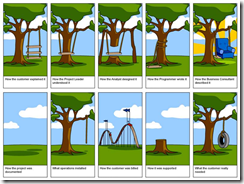
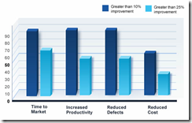

## The software design process

## Why Waterfall fails

•Waterfall projects have 3x the failure rate (29% vs. 9%) and 1/3 the success rate (14% vs. 42%) of Agile projects (Standish Group, CHAOS Report 2012)

•Inventor of Waterfall [Winston W. Royce](http://pascal.gugenberger.net/thoughts/waterfall-accident.html) described in his academic paper written in 1970 that it was "risky and invites failure" and went on to describe Incremental development.

•Recent failed waterfall projects that scrapped

•UK Govt. [£12 Billion](http://www.dailymail.co.uk/news/article-2040259/NHS-IT-project-failure-Labours-12bn-scheme-scrapped.html) for national program for NHS IT

•US Air Force - 6 year project with cost of [$1.3 Billion](http://www.nytimes.com/2012/12/09/technology/air-force-stumbles-over-software-modernization-project.html?_r=0)

•QLD Health [$1.2 Billion](http://www.cio.com.au/article/426920/qld_health_payroll_it_train_wrecks_preventable/)

## Agile vs. Waterfall

Agile techniques deliver business-critical solutions at 40% lower cost, 50% faster and with significantly greater fit and quality.

Source - © Standish Group CHAOS report 1994 – 2010. Sample size over 40,000 completed IT Projects.

### Why Change?

History has proven that those businesses that do adapt die.

[Kodak](http://www.forbes.com/sites/chunkamui/2012/01/18/how-kodak-failed/) failed to embrace digital cameras

## How will Agile help us?

•Reduce time to market

•Reduce risk by finding errors earlier in the process

•Early access to the software during the life cycle

•Greater flexibility to change

•Early cancellation(or failure) hurts less

•Reduced defect count

•Maintain compliance levels and auditory requirements

•Improved ROI

•Improved transparency for stake holders/management
