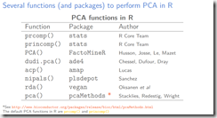

# PCA

**Principal Components Analysis** (PCA) allows us to study and explore a set of quantitative variables measured on a set of objects

###### Core Idea

 

With PCA we seek to reduce the dimensionality (reduce the number of variables) of a data set while retaining as much as possible of the variation present in the data

Before performing a PCA(or any other multivariate method) we should start with some preliminary explorations

- Descriptive statistics
- Basic graphical displays
- Distribution of variables
- Pair-wise correlations among variables
- Perhaps transforming some variables
- ETC

###### 

The minimal output from any PCA should contain 3 things:

**Eigenvalues** provide information about the amount of variability captured by each principal component

**Scores** or PCs (principal components) that provide coordinates to graphically represent objects in a lower dimensional space

**Loadings** provide information to determine what variables characterize each principal component

###### Some questions to keep in mind

- How many PCs should be retained?
- How good (or bad) is the data approximation with the retained PCs?
- What variables characterize each PC?
- Which variables are influential, and how are they correlated?
- Which variables are responsible for the patterns among objects?
- Are there any outlier objects?

###### Links

[http://genomicsclass.github.io/book/pages/pca\_svd.html](http://genomicsclass.github.io/book/pages/pca_svd.html)

[http://www.r-bloggers.com/using-r-two-plots-of-principal-component-analysis/](http://www.r-bloggers.com/using-r-two-plots-of-principal-component-analysis/)

[http://www.sthda.com/english/wiki/principal-component-analysis-in-r-prcomp-vs-princomp-r-software-and-data-mining](http://www.sthda.com/english/wiki/principal-component-analysis-in-r-prcomp-vs-princomp-r-software-and-data-mining)

[http://stats.stackexchange.com/questions/143905/loadings-vs-eigenvectors-in-pca-when-to-use-one-or-another](http://stats.stackexchange.com/questions/143905/loadings-vs-eigenvectors-in-pca-when-to-use-one-or-another)

[https://www.dropbox.com/s/mjdtdpgji74cut1/PCA\_with\_R.pdf?dl=0](https://www.dropbox.com/s/mjdtdpgji74cut1/PCA_with_R.pdf?dl=0)

[http://stats.stackexchange.com/questions/2691/making-sense-of-principal-component-analysis-eigenvectors-eigenvalues/35653#35653](http://stats.stackexchange.com/questions/2691/making-sense-of-principal-component-analysis-eigenvectors-eigenvalues/35653#35653)
